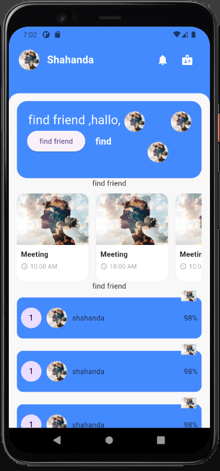
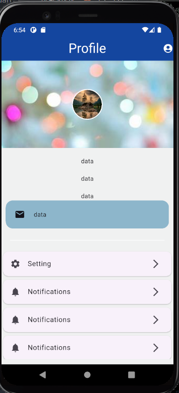
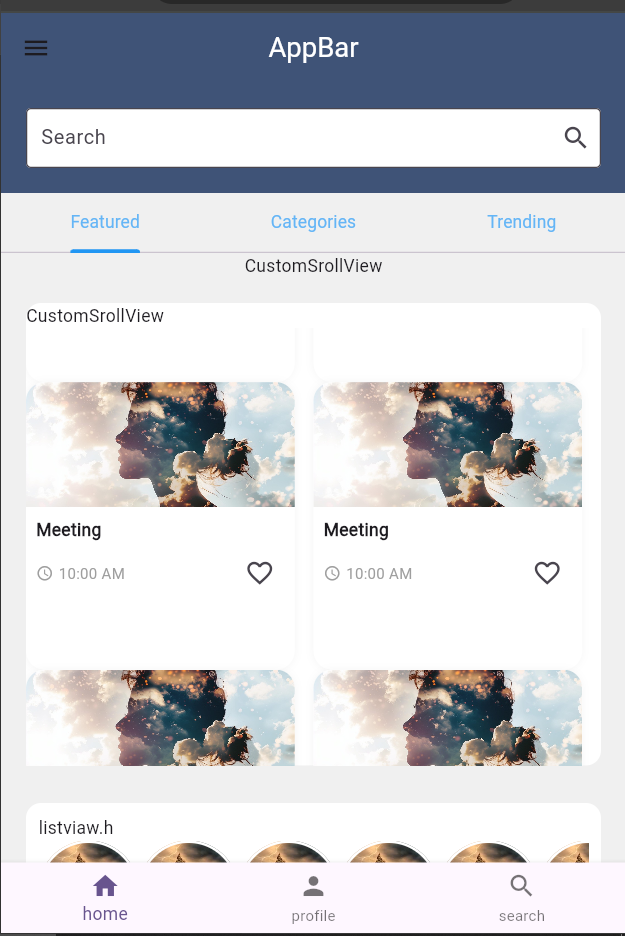
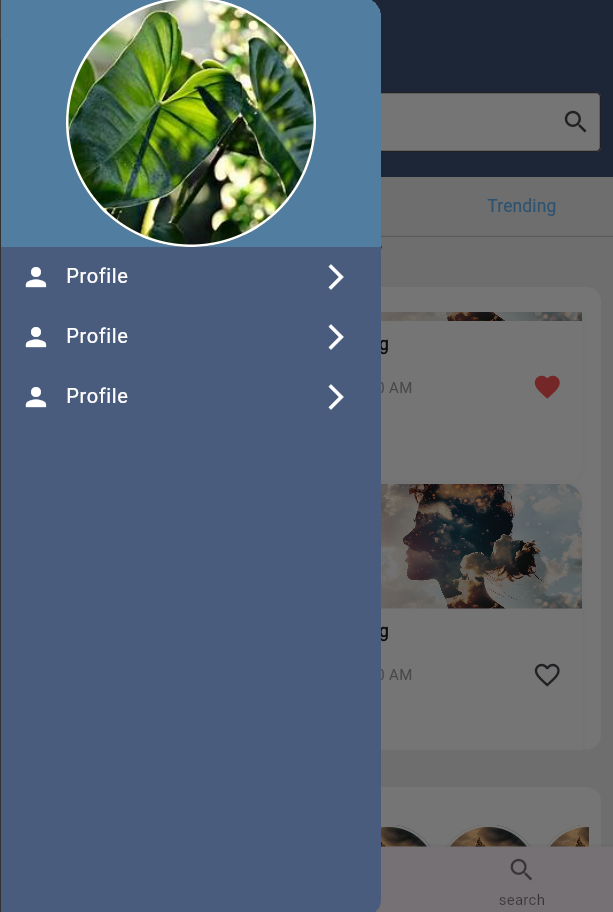

# studing

A new Flutter project.
## two tasks:
 
 ### home page ,
 
 ### profile page,
 
 ### Search Screan
 
 
 ### auth task and pageviaw
 
 
 

- [Lab: Write your first Flutter app](https://docs.flutter.dev/get-started/codelab)
- [Cookbook: Useful Flutter samples](https://docs.flutter.dev/cookbook)

For help getting started with Flutter development, view the
[online documentation](https://docs.flutter.dev/), which offers tutorials,
samples, guidance on mobile development, and a full API reference.
